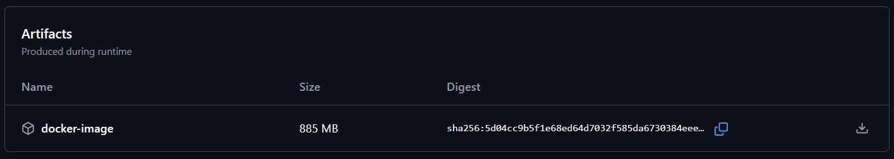

<!--
# SPDX-License-Identifier: Apache-2.0
# SPDX-FileCopyrightText: 2025 The Linux Foundation
-->

# 🛠️ Docker Save Images Action

Docker images created by a job (Ex: build job) and required in another
job (Ex: Deploy and Test) need to be temporarily saved in order for them
to be available across jobs.
This action takes a space separated list of docker image names along with their
tags as input and creates a tar file and uploads the tar as artifacts to GitHub
action/workflow runs.

## docker-save-images-action

## Usage Example

<!-- markdownlint-disable MD046 -->

```yaml
steps:
  - name: Save Artifacts
    uses: lfreleng-actions/docker-save-images-action
    with:
      docker-artifacts-to-save: ${{ inputs.docker-artifacts-to-save }}
```

<!-- markdownlint-enable MD046 -->

## Inputs

<!-- markdownlint-disable MD013 -->

| Name          | Required | Default | Description                             |
| ------------- | -------- | ------- | --------------------------------------- |
| docker-artifacts-to-save   | True    | ""     | Comma separated list of docker image names along with their tags   |

Ex: docker-artifacts-to-save: "o-ran-sc/oam-oam-controller/sdnr-image:latest o-ran-sc/oam-oam-controller/sdnr-web-image:latest"

<!-- markdownlint-enable MD013 -->

## Outputs

This action does not produce explicit outputs, but generates the following
artifacts:

- An artifact with the name "docker-image" and persisted for a day in the
  workflow runtime. The persisted artifact is visible in the workflow
  run at the bottom of the page



## Implementation Details

The action performs the following steps:

1. **Saves docker images as tar**: Uses the "docker save" command and passes
    the comma separated image list to create a tar file
2. **Upload tar file**: Uploads the created tar file using the
    [upload-artifact](https://github.com/actions/upload-artifact) action
