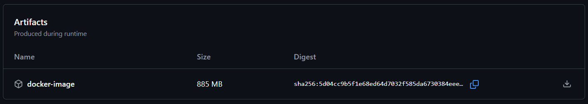

<!--
# SPDX-License-Identifier: Apache-2.0
# SPDX-FileCopyrightText: 2025 The Linux Foundation
-->

# 🛠️ Docker Save Images Action

Docker images created by a job (Ex: build job) and required in another
job (Ex: Deploy and Test) need to be temporarily saved in order for them
to be available across jobs.
This action takes a space separated list of docker image names along with their
tags as input and creates a tar file and uploads the tar as artifacts to GitHub
action/workflow runs.

## docker-save-images-action

## Usage Example

<!-- markdownlint-disable MD046 -->

```yaml
steps:
  - name: Save Artifacts
    uses: lfreleng-actions/docker-save-images-action
    with:
      docker-artifacts-to-save: ${{ inputs.docker-artifacts-to-save }}
```

<!-- markdownlint-enable MD046 -->

## Inputs

<!-- markdownlint-disable MD013 -->

| Name                     | Required | Default        | Description                                                                                          |
| ------------------------ | -------- | -------------- | ---------------------------------------------------------------------------------------------------- |
| docker-artifacts-to-save | True     | ""             | Space separated list of docker image names along with their tags                                     |
| mode                     | False    | "single"       | Archive layout: "single" for one combined tar, "per-image" for one tar per image                     |
| artifact-name            | False    | "docker-image" | Name of the uploaded artifact; vary it when a reusable workflow runs more than once in a run         |
| overwrite                | False    | "true"         | Whether uploading replaces an existing artifact of the same name                                     |
| retention-days           | False    | "1"            | Artifact lifetime in days                                                                            |
| output-directory         | False    | ""             | Directory for archives; empty resolves to the workspace root (single) or "docker-images" (per-image) |
| fail-on-empty            | False    | "true"         | Whether an empty image list fails the step                                                           |

<!-- markdownlint-enable MD013 -->

Ex: docker-artifacts-to-save: "o-ran-sc/oam-oam-controller/sdnr-image:latest o-ran-sc/oam-oam-controller/sdnr-web-image:latest"

The defaults reproduce the action's original behaviour: one combined
`docker-images.tar` at the workspace root, uploaded as `docker-image`,
overwriting, retained for a day.

### Choosing a mode

`single` suits the common case: a build job saves its images and a later
job loads them all.

`per-image` suits consumers that process images individually, such as
generating an SBOM per image or scanning each image separately, since a
consumer must first unpack a combined tar and split it. Filenames
derive from the image reference with `/` and `:` mapped to `_`.
Distinct references can collapse to the same filename (`a/b:1` and
`a_b:1` both yield `a_b_1`), so a collision fails the step instead of
overwriting an earlier archive without warning.

### Running a reusable workflow more than once

GitHub scopes artifacts per workflow **run**, not per job or per
`workflow_call` invocation. A reusable workflow invoked more than once
in a run produces repeated uploads sharing one name, and with
`overwrite` enabled the last writer wins without warning. Give each
invocation its own `artifact-name`:

<!-- markdownlint-disable MD046 -->

```yaml
- uses: lfreleng-actions/docker-save-images-action
  with:
    docker-artifacts-to-save: "app:1.0 sidecar:1.0"
    mode: "per-image"
    artifact-name: "docker-archives-${{ inputs.build_id }}"
    overwrite: "false"
```

<!-- markdownlint-enable MD046 -->

## Outputs

<!-- markdownlint-disable MD013 -->

| Name              | Description                                                                             |
| ----------------- | --------------------------------------------------------------------------------------- |
| docker-image-tar  | Path of the combined tar, in "single" mode                                              |
| archive-directory | Directory holding the written archive(s)                                                |
| archive-count     | Number of archives written; 0 when the image list was empty and fail-on-empty was false |
| artifact-name     | Name of the uploaded artifact, echoed for consumers                                     |
| archive-paths     | Newline-separated list of the archive files written                                     |

<!-- markdownlint-enable MD013 -->

The action also uploads an artifact, by default named `docker-image` and
retained for a day. The artifact is visible in the workflow run at the
bottom of the page.



## Implementation Details

The action performs the following steps:

1. **Saves docker images as tar**: Uses the "docker save" command and passes
    the space separated image list to create a tar file
2. **Upload tar file**: Uploads the created tar file using the
    [upload-artifact](https://github.com/actions/upload-artifact) action
